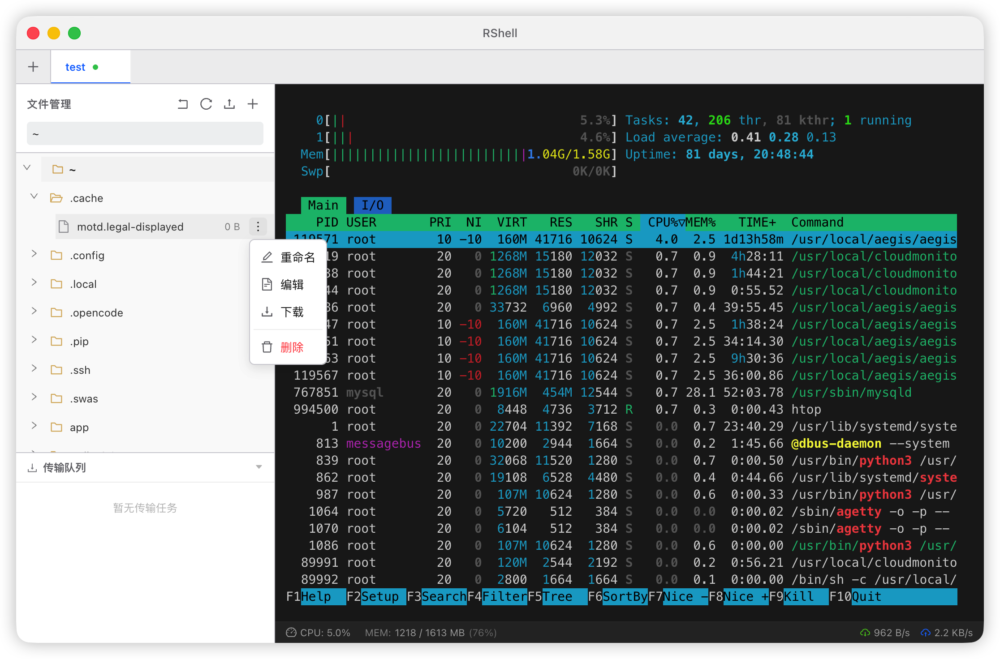

# RShell

RShell 是一款基于 Electron、React 19 和 Zustand 构建的现代化、高性能远程终端与文件管理工具。它旨在为开发者提供一个简洁、快速且功能强大的 SSH 协作环境，集成了终端控制、SFTP 文件浏览以及在线代码编辑功能。


## 📸 预览




## ✨ 特性

-   🚀 **原生级性能**：基于 `electron-vite` 构建，响应极速，内存占用低。
-   💻 **全功能终端**：集成 `xterm.js`，支持 256 色、表情符号渲染、自动缩放及流畅的输入体验。
-   📂 **可视化 SFTP 浏览器**：
    -   类 Finder/资源管理器的交互体验。
    -   支持文件/文件夹的递归上传、下载、删除及重命名。
    -   高频传输时 UI 依然流畅（基于 Zustand 状态管理优化）。
-   📝 **内置代码编辑器**：集成 `CodeMirror 6`，支持多种编程语言语法高亮、自动保存及大文件读取限制保护。
-   🎨 **现代化 UI**：基于 Ant Design 5.x 深度定制，支持 macOS 沉浸式标题栏。
-   🛡️ **多会话管理**：支持开启多个 SSH 会话标签页，独立管理每个连接的状态。

## 🛠️ 技术栈

-   **核心**: Electron 34
-   **构建工具**: Vite 7 + electron-vite
-   **前端框架**: React 19 (TypeScript)
-   **状态管理**: Zustand (用于多会话与传输任务调度)
-   **通讯**: SSH2 (SFTP & Shell)
-   **UI 组件**: Ant Design 5.x
-   **编辑器**: CodeMirror 6

## 🚀 快速开始

### 环境要求

-   [Node.js](https://nodejs.org/) (建议 v18.0.0 或更高)
-   npm 或 yarn

### 开发环境搭建

1.  **克隆仓库**
    ```bash
    git clone https://github.com/your-username/rshell.git
    cd rshell
    ```

2.  **安装依赖**
    ```bash
    npm install
    ```

3.  **启动开发模式**
    ```bash
    npm run dev
    ```

### 构建打包

根据你的操作系统生成安装包：

```bash
# 打包 macOS 版本 (arm64)
npm run package:mac

# 打包 Windows 版本 (x64)
npm run package:win
```

> **macOS 打包说明**：首次打包前需运行以下脚本生成自签名证书（每台机器只需执行一次）：
> ```bash
> bash scripts/setup-cert.sh
> npm run package:mac
> ```
> 自签名证书不受 Apple 信任，打包的应用在其他 Mac 上首次打开时会提示"无法验证开发者"，
> 右键点击应用 → **打开** 即可正常使用。

## 📂 项目结构

```text
├── resources/           # 静态资源 (图标等)
├── src/
│   ├── main/           # Electron 主进程逻辑 (SSH 服务、IPC 管理)
│   ├── preload/        # 预加载脚本 (安全桥接)
│   ├── renderer/       # 前端渲染进程 (React UI)
│   │   └── src/
│   │       ├── components/ # 业务组件 (FileBrowser, Terminal 等)
│   │       ├── hooks/      # 自定义 Hooks (解耦业务逻辑)
│   │       └── store/      # Zustand 状态中心
│   └── shared/         # 主从进程共享的类型定义
├── package.json        # 项目配置与打包配置
└── tsconfig.json       # TypeScript 配置
```

## 🤝 贡献

欢迎通过 Issue 报告 Bug 或提出功能建议。如果你想直接改进代码，请提交 Pull Request。

## 📄 开源协议

本项目基于 [MIT License](LICENSE) 协议开源。
